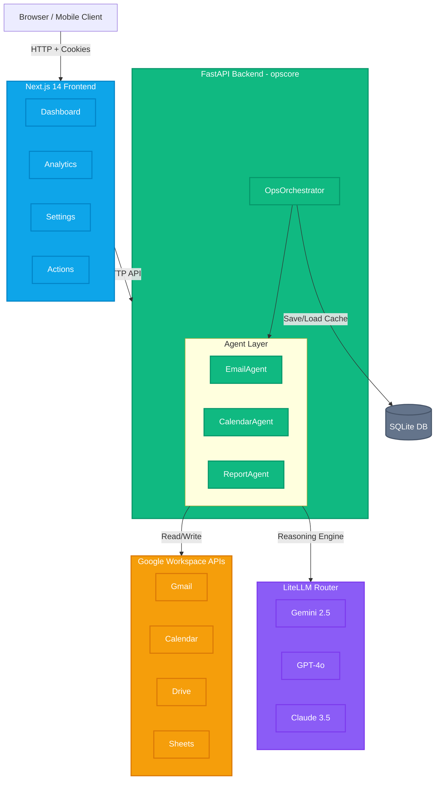

# OpsCore — AI-Powered Freelance Operations Platform

OpsCore is a production-grade, multi-agent AI system built for **Hack2Skill PromptWars 2026**. It unifies Gmail, Google Calendar, Google Drive, and Google Sheets into a single intelligent command center — eliminating the tab-switching chaos that costs freelancers 20–30% of their productivity.

---

## ✨ Key Features

| Feature | Description |
|---|---|
| **On-Demand AI Analytics** | Full-page analytics engine with priority ranking (High/Medium/Low) and AI-generated reports |
| **Multi-Provider BYOK** | Add API keys for Gemini, OpenAI, Anthropic, Grok, Mistral, DeepSeek — with failover support |
| **Token-Aware Architecture** | User-configurable analysis scope (1–50 items) with cost warnings before every AI call |
| **Native Email Rendering** | Sandboxed iframe with smart HTML/plain-text detection for proper email display |
| **One-Click Actions** | Deep Summarize, Draft Reply, Graphify Data, Inject to Calendar — all AI-powered |
| **Secure Key Storage** | API keys encrypted in HttpOnly cookies via `itsdangerous` — never in localStorage |
| **Auto-Dismissing Errors** | 15-second countdown error bar with manual dismiss |

---

## 🧠 AI Architecture

OpsCore uses a **4-agent orchestration pipeline** coordinated by `asyncio.gather`:

| Agent | Responsibility |
|---|---|
| `EmailAgent` | Classifies threads by urgency, generates context-aware drafts |
| `CalendarAgent` | Extracts deadlines, detects conflicts, suggests focus blocks |
| `ReportAgent` | Synthesizes Drive files and Sheets into project status reports |
| `OpsOrchestrator` | Coordinates all agents concurrently, merges outputs |

**Supported Models (BYOK via LiteLLM):**
- Gemini 2.5 Preview / 2.0 Flash (native Google GenAI SDK)
- OpenAI GPT-4o / GPT-4o Mini
- Anthropic Claude 3.5 Sonnet
- xAI Grok
- Mistral, Cohere, DeepSeek

---

## 📐 Architecture



Data flow:
1. **Login** → Google OAuth2 → raw data fetched via `asyncio.gather` (no AI call)
2. **Browse** → Emails, Calendar, Drive displayed instantly
3. **Analyze** → User opens Analytics → confirms token warning → single AI call returns priority queue + report
4. **Act** → Click priority items to jump to source → Draft Reply, Summarize, Graphify

---

## 🛠️ Tech Stack

| Layer | Technology |
|---|---|
| Frontend | Next.js 14, TailwindCSS, Framer Motion, Recharts, ReactMarkdown |
| Backend | FastAPI (Python 3.10+), Uvicorn |
| AI | Google GenAI SDK, LiteLLM (multi-provider router) |
| Auth | Google OAuth2 (OpenID Connect) |
| Security | HttpOnly encrypted cookies (`itsdangerous`) |
| Database | SQLite via SQLAlchemy |
| Deploy | Docker, Google Cloud Run, Supervisor |

---

## ⚙️ Local Development

### Prerequisites
- Python 3.10+
- Node.js 18+
- GCP project with Gmail, Calendar, Drive, and Sheets APIs enabled
- OAuth2 credentials (Web Application type)

### 1. Clone & Configure

```bash
git clone https://github.com/RajTewari01/opscore-freelance-assistant.git
cd opscore-freelance-assistant
cp .env.example .env
# Fill in: GOOGLE_CLIENT_ID, GOOGLE_CLIENT_SECRET, APP_SECRET_KEY
```

### 2. Backend

```bash
pip install -r opscore/requirements.txt
python main.py                    # → http://localhost:8000
```

### 3. Frontend

```bash
cd frontend
npm install
npm run dev                       # → http://localhost:3000
```

Open **http://localhost:3000**, sign in with Google, add your AI key in Settings, and start working.

---

## 🚀 Cloud Deployment (Render)

Render is the recommended deployment platform as it natively supports the Dockerized Next.js + FastAPI architecture with zero configuration.

### 1. Deploy on Render

1. Create a new **Web Service** on [Render](https://render.com)
2. Connect your GitHub repository.
3. Use the **Docker** runtime environment.
4. Set the **Instance Type** to Free (0.1 CPU, 512 MB).

### 2. Configure Environment Variables

In your Render dashboard, navigate to **Environment** and add the following variables. Note the specific value for `BACKEND_URL` which forces IPv4 loopback to avoid Node.js IPv6 resolution issues:

```env
GOOGLE_CLIENT_ID=your-google-client-id.apps.googleusercontent.com
GOOGLE_CLIENT_SECRET=your-google-client-secret
GEMINI_API_KEY=your-gemini-key
APP_SECRET_KEY=generate-a-secure-random-string
BACKEND_URL=http://127.0.0.1:8000
OAUTHLIB_RELAX_TOKEN_SCOPE=1
OAUTHLIB_INSECURE_TRANSPORT=1
```

*(Note: `GOOGLE_REDIRECT_URI` is hardcoded to the Render URL in `config.py` for simplicity)*

### 3. Update OAuth Redirect

In [GCP Console → Credentials](https://console.cloud.google.com/apis/credentials):
- Add your Render URL to **Authorized redirect URIs**: `https://opscore-freelance-assistant.onrender.com/auth/callback`
- Add to **Authorized JavaScript origins**: `https://opscore-freelance-assistant.onrender.com`

---

## 🔐 Google API Scopes

| Scope | Purpose |
|---|---|
| `gmail.readonly` + `gmail.send` | Read inbox + send drafted replies |
| `calendar.events` | Read events + create new events |
| `drive.metadata.readonly` | List recently modified project files |
| `spreadsheets.readonly` | Read sheets for report generation |

---

## 📝 API Endpoints

| Method | Endpoint | Description |
|---|---|---|
| `GET` | `/auth/login` | Initiates Google OAuth2 flow |
| `GET` | `/auth/status` | Returns auth status + user profile |
| `POST` | `/api/fetch-data` | Fetches raw data from all Google APIs (no AI) |
| `POST` | `/api/analytics` | Runs AI priority analysis + generates report |
| `POST` | `/api/analyze` | Full orchestrator pipeline (legacy) |
| `POST` | `/api/action` | Execute actions (summarize, draft, graphify, calendar) |
| `GET` | `/api/history` | Retrieve past analysis runs from SQLite |

---

## 📂 Project Structure

```
opscore-freelance-assistant/
├── frontend/              # Next.js 14 UI
│   ├── app/page.tsx       # Main dashboard (single-page app)
│   └── next.config.ts     # Proxy config + standalone output
├── opscore/               # FastAPI backend
│   ├── main.py            # App factory + CORS + middleware
│   ├── routes/
│   │   ├── auth.py        # OAuth2 + key encryption
│   │   └── assistant.py   # All API endpoints
│   ├── agents/
│   │   └── orchestrator.py # Multi-agent coordinator
│   ├── services/
│   │   ├── gmail_service.py
│   │   ├── calendar_service.py
│   │   ├── gemini_service.py
│   │   └── sheets_service.py
│   └── models/
│       ├── schemas.py     # Pydantic request/response models
│       └── db_models.py   # SQLAlchemy ORM
├── Dockerfile             # Multi-stage production build
├── supervisord.conf       # Process manager for Docker
├── main.py                # Backend entry point
└── .env.example           # Environment template
```

---

*Built for PromptWars 2026 × Hack2Skill × Google Cloud*
